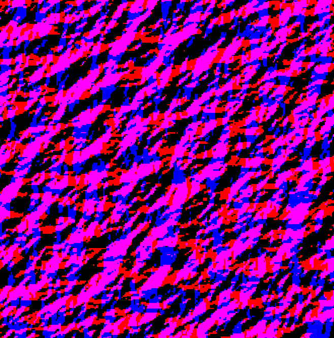

# INF443 - Ocean FFT

## Description

Realistic ocean wave 🌊 simulation primarily based on [J. Tessendorf's paper](https://citeseerx.ist.psu.edu/viewdoc/download?doi=10.1.1.161.9102&rep=rep1&type=pdf). C++ implementation using openGL and [CGP library](https://github.com/drohmer/CGP) (linked as a submodule).

* Project for the 3D-Graphics course (INF443) at Ecole Polytechnique (France).

* Authors: Artur César Araújo Alves (czartur), Kseniia Khmelnikova (KseniaKhmelnk) 

## Galery

* GIF sample:

<p align="center">
    
</p>    

* Demo video: [link]

Everything was recorded for a 256x256 FFT resolution and 25 chunks + tesselation. We got 60 fps using a Nvidia GTX 1050 Ti.

## Usage

- In root folder:

```sh
cmake -B build
cd build
make

./{root_folder_name}
```

- Player controls:
``` 
WASD -> (Translate) Forward/Backward/Left/Right
R/F -> (Translate) Up/Down
Q/E -> (Twist) Left/Right

SHIFT + C -> Switch cursor mode
# immersive: mouse move = camera move
# non-immersive: mouse move + left/right click = camera move
```

## Features

We have done so far:

- Ocean computation 🌊
    * Fast Fourier Transform
    * Chunk / "Tesselation" 
- Fog on the horizon ☁️
- Day/Night cycle ☀️🌙
- Height based ocean color 🏔️

Possible improvements / increments:

- Foam
- Fresnel model: supports water refraction
- QuadTree / LOD: optimize ocean rendering

## Ocean Computation 🌊

To proceduraly render an ocean, we generate a spectrum $\tilde{h}(\mathbf{k}, t)$ encoding it in a texture for $N$ different wave vectors $\mathbf{k}$. Following J. Tessendorf's paper, we chose the *Philips spectrum* modulated with a *gaussian noise*.

As described in the paper, from this spectrum, we can calculte wave height, horizontal displacement and slope for $N$ diferent horizontal 2D vectors $\mathbf{x}$. 

$$ h(\mathbf{x},t) = \sum_{\mathbf{k}} \tilde{h}(\mathbf{k}, t) \text{ } \exp(i\mathbf{k} \cdot x)$$

$$ \mathbf{D}(\mathbf{x},t) = \sum_{\mathbf{k}} -i\frac{\mathbf{k}}{k} \text{ } \tilde{h}(\mathbf{k}, t) \text{ } \exp(i\mathbf{k} \cdot x)$$

$$ \mathbf{n}(\mathbf{x},t) = \nabla h(\mathbf{x},t) = \sum_{\mathbf{k}} i \mathbf{k}\text{ } \tilde{h}(\mathbf{k}, t) \text{ } \exp(i\mathbf{k} \cdot x)$$

A simple brute force algorithm to do these calculations would lead to a quadratic complexity. Since we need to perform them in each animation frame, this would be too much expensive and that's why we need fast fourier transform: FFT gives us $O(N \text{ } log(N))$ complexity. 

### 1. Fast Fourier Transform

A 2D FFT was implemented for $N = 256 \times 256$ using Stockham's algorithm and in order to benefit from GPU's parallelization power we use GLSL's compute shaders. Having the spectrum as input, we use the equations above to calculate two outputs: $dx, dy, dz$ (displacements) and $nx, ny, nz$ (normals). Everything is encoded in texture maps. 

* For each direction $x, y, z$, we calculate both normal and displacement maps simultaneously and independently by encoding all information in separated color channels (Red/Green for disp. && Blue/Alpha for norm.).

* Since it is a 2D-FFT, we have to perform each computation in horizontal and vertical directions.

In resume, we compute a total of 6 FFT's per frame, generating displacement and normal maps from a spectrum texture:

<div align="center">
    
| Input | Output 1 | Output 2 |
|:---:|:---:|:---:|
|  |  |  |
|  Varying spectrum  | #RGB: dx, dy, dz | #RGB: nx, ny, nz |

</div>

<!-- <div style="display: flex; justify-content: center;">
    <div style="display: flex; flex-direction: column; align-items: flex-start; justify-content: center; margin-right: 50px;">
    <figure>
        
        <figcaption style="text-align: center;">Varying spectrum</figcaption>
    </figure>
    </div>
    <div style="display: flex; flex-direction: column; align-items: flex-end;">
    <figure>
        
        <figcaption style="text-align: center;"> #RGB: dx, dy, dz </figcaption>
    </figure>
    <figure>
        
        <figcaption style="text-align: center;"> #RGB: nx, ny, nz </figcaption>
    </figure>
    </div>
</div> -->


### 2. Chunk and Tesselation

The procedure described above generates a single water quad. To make it infinite, we can simply arbitrarily repeat this quad, with the observation that the generating textures are **perfectly tileables**:

<p align="center">
    
    
</p>


* As an optimization, we use a chunk model (thanks to [Guile Vieira](https://github.com/guilevieiram) for the idea) to render only a few of these patches (currently 25) based both on camera position and field of view.

* We also reduce the mesh resolution of patches far away from the camera since we don't need too much details there (simplistic tesselation). 

## Fog on the horizon ☁️
A "mist"(fog) effect can be achieved by attenuating the color of the fragment according to its depth. A fragment close to the camera will have a phong illumination, while a distant fragment will tend towards the color of the mist.

## Day/Night cycle ☀️🌙

Day/Night cycle effect can be achieved by attenuating background color in a fragment shader according to time.

A sphere representing the sun moves accordingly to this cycle. 

## Height based ocean color 🏔️

Ocean water is slightly more brighter at the top of the waves. We try to simulate this effect by interpolating two base water colors using height as a factor. 

## References

- For the main ideas: [J. Tessendorf's paper](https://www.researchgate.net/publication/264839743_Simulating_Ocean_Water), [Jump Trajectory's video](https://www.youtube.com/watch?v=kGEqaX4Y4bQ)

- For FFT: [Introduction to the Stockham FFT](http://wwwa.pikara.ne.jp/okojisan/otfft-en/stockham1.html), [General FFT's on GPU [Microsoft]](https://www.microsoft.com/en-us/research/wp-content/uploads/2016/02/tr-2008-62.pdf)

- For Chunk: [JpTanaka/Doomicraft](https://github.com/JpTanaka/Doomicraft/tree/main)

- For CGP: [Computer Graphics Programming library](https://imagecomputing.net/cgp/)
